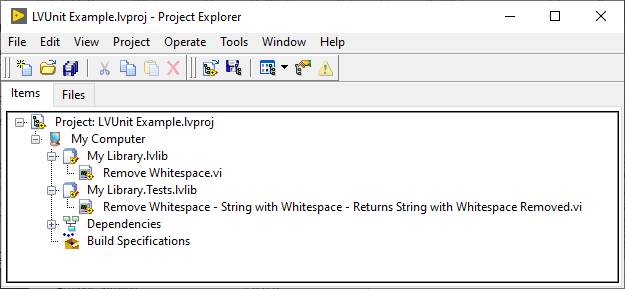
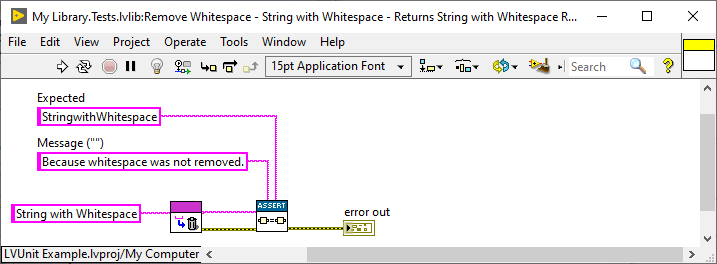
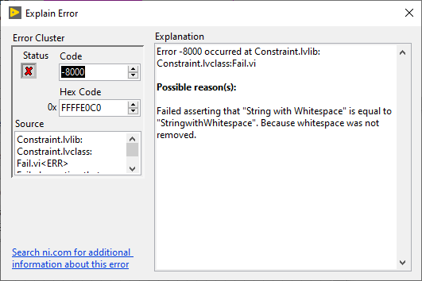
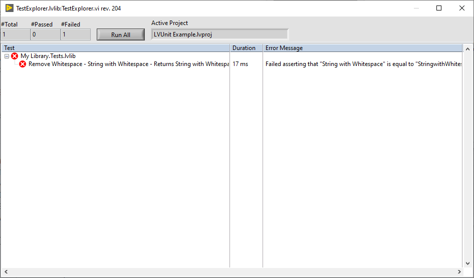
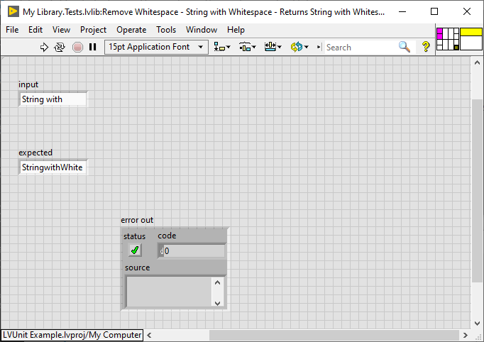
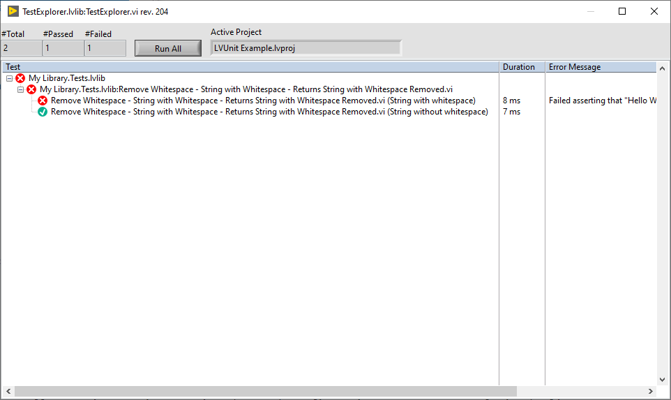

<!-- ABOUT THE PROJECT -->
## About The Project
**LVUnit** is a unit testing framework for LabVIEW&trade;.

## Built With
* [LabVIEW&trade;](https://ni.com/labview)

<!-- GETTING STARTED -->
## Getting Started
To get a local copy up and running follow these simple steps.

### Prerequisites
* LabVIEW&trade; 2017 or later
* VI Package Manager
* (optional) LabVIEW&trade; Unit Test Framework Toolkit 2017 or later -- some features are not available when this toolkit is missing.

### Installation
1. Clone the repo
    ```sh
    git clone https://github.com/logmanoriginal/lvunit.git
    ```
2. Install packages
    ```sh
    start .vipc
    ```
    Or apply `.vipc` manually.

<!-- USAGE EXAMPLES -->
## Usage
Test suites are defined by project libraries with suffix "Tests.lvlib" (can be changed).



Every public VI inside such a project library is considered a test case. Test cases must have an error output terminal and should use assertion functions.



Any error returned by a test case is considered a test failure, even if the error does not originate from an assertion function. Run the VI to get the result on the error output control.



Use **Tools** > **Test Explorer** to run all tests in a project.



Double-click a test case to open the VI.

### Theories
Theories are test cases with input terminals.



Place a JSON file next to the VI with the same file name:
```JSON
[
  {
    "name": "String with whitespace",
    "data": {
      "input": "Hello World!",
      "expected": "HelloWorld!"
    }
  },
  {
    "name": "String without whitespace",
    "data": {
      "input": "HelloWorld!",
      "expected": "HelloWorld!"
    }
  }
]
```

Use **Tools** > **Test Explorer** to run all tests in a project. Notice that each configuration appears separately in the list.



Double-click a test case to open the VI with that configuration.

<!-- ROADMAP -->
## Roadmap
See [open issues](https://github.com/logmanoriginal/lvunit/issues) for a list of proposed features (and known issues).

<!-- CONTRIBUTING -->
## Contributing
Contributions are what make the open source community such an amazing place. Any contributions you make are greatly appreciated :sparkling_heart:

1. Fork the Project
2. Create your Feature Branch (`git checkout -b feature/AmazingFeature`)
3. Commit your Changes (`git commit -m 'Add some AmazingFeature'`)
4. Push to the Branch (`git push origin feature/AmazingFeature`)
5. Open a Pull Request

Keep in mind that LabVIEW&trade; VIs are binary files, which are difficult to merge.
- Only change a single VI or library.
- Avoid conflicts with other pull requests (don't work on the same libraries or VIs).
- Send VI Snippets (via issues) instead of pull requests when possible.

<!-- LICENSE -->
## License
Distributed under the BSD-3-Clause license. See [LICENSE](LICENSE) for more information.

<!-- CONTACT -->
## Contact

Project Link: [https://github.com/logmanoriginal/lvunit](https://github.com/logmanoriginal/lvunit)

<!-- ACKNOWLEDGEMENTS -->
## Acknowledgements
* [JSONtext](https://bitbucket.org/drjdpowell/jsontext)
