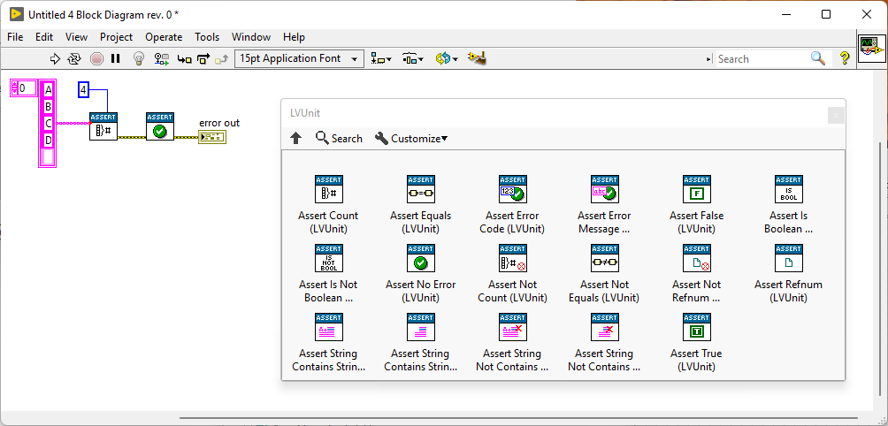
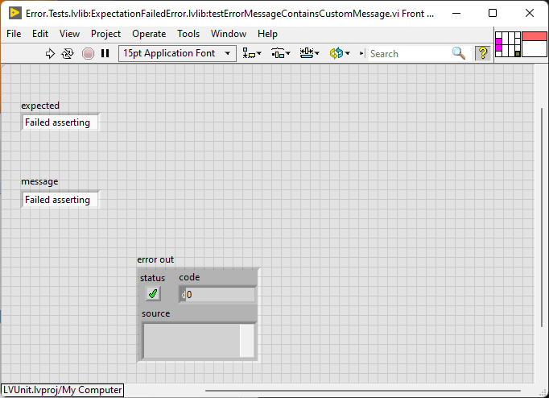
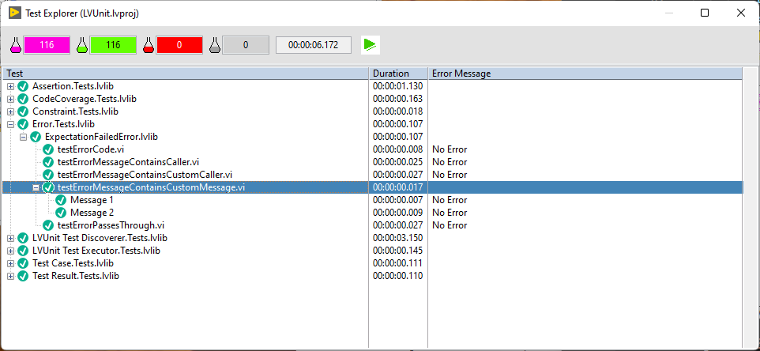

<!-- ABOUT THE PROJECT -->
## About The Project
**LVUnit** is a unit testing framework for LabVIEW&trade;.

## Built With
* [LabVIEW&trade;](https://ni.com/labview)

<!-- GETTING STARTED -->
## Getting Started
To get a local copy up and running follow these simple steps.

### Prerequisites
* LabVIEW&trade; 2017 or later
* VI Package Manager

### Installation
1. Clone the repo
    ```sh
    git clone https://github.com/logmanoriginal/lvunit.git
    ```
2. Install packages
    ```sh
    start .vipc
    ```
    Or apply `.vipc` manually.

<!-- USAGE EXAMPLES -->
## Usage

To create a test case, simply place one of the assertion functions on your block diagram and create an indicator for the error output terminal.



Run your tests manually, or use Test Explorer to discover and execute all tests in your project.

You can open Test Explorer from the Tools menu or via the Quick Drop Shortcut 'Ctrl+E'.


### Parameterized Tests (Theories)

Theories are test cases that can be executed with different data sets.

To create a theory, simply connect controls to terminals.



To define data sets for your theory, place a JSON file with the same file name in the same folder as the test case.

For example:
* Theory1.vi
* Theory1.json

The JSON file has the following syntax:
```JSON
[
  {
    "name": "Message 1",
    "data": {
      "expected": "Failed asserting that...",
      "message": "Failed asserting that..."
    }
  },
  {
    "name": "Message 2",
    "data": {
      "expected": "Test failed!",
      "message": "Test failed!"
    }
  }
]
```

Use Test Explorer to discover and execute all theories in your project. Notice that an entry is added for each data set in your theory.



### Advanced Features

* You can open a test case directly from Test Explorer by double-clicking on the test case in the tree. To open a theory, you have to double-click on one of its data sets. This will populate the theory with the selected data set.
* Test Explorer categorizes test cases based on their qualified name. You can place test cases in project libraries to categorize them in Test Explorer.
* Test cases must be public. You can disable a test case by changing the scope (or the scope of its parent) to private.
* Test cases that return an error at the error output terminal are considered failed. This includes any error that isn't a result of an assertion.
* Test Explorer automatically discovers tests in your project. When you select a different project, Test Explorer scans the new project automatically.

<!-- ROADMAP -->
## Roadmap
See [open issues](https://github.com/logmanoriginal/lvunit/issues) for a list of proposed features (and known issues).

<!-- CONTRIBUTING -->
## Contributing
Contributions are what make the open source community such an amazing place. Any contributions you make are greatly appreciated :sparkling_heart:

1. Fork the Project
2. Create your Feature Branch (`git checkout -b feature/AmazingFeature`)
3. Commit your Changes (`git commit -m 'Add some AmazingFeature'`)
4. Push to the Branch (`git push origin feature/AmazingFeature`)
5. Open a Pull Request

Keep in mind that LabVIEW&trade; VIs are binary files, which are difficult to merge.
- Only change a single VI or library.
- Avoid conflicts with other pull requests (don't work on the same libraries or VIs).
- Send VI Snippets (via issues) instead of pull requests when possible.

<!-- LICENSE -->
## License
Distributed under the BSD-3-Clause license. See [LICENSE](LICENSE) for more information.

<!-- CONTACT -->
## Contact

Project Link: [https://github.com/logmanoriginal/lvunit](https://github.com/logmanoriginal/lvunit)

<!-- ACKNOWLEDGEMENTS -->
## Acknowledgements
* [JSONtext](https://bitbucket.org/drjdpowell/jsontext)
* [JUnit Results Library](https://github.com/NISystemsEngineering/LV-JUnit/)
