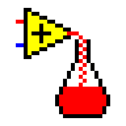
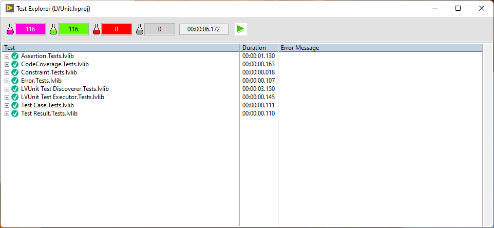
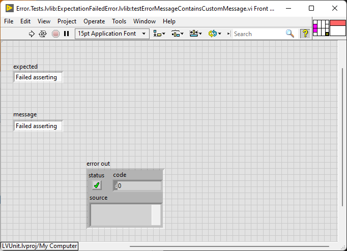
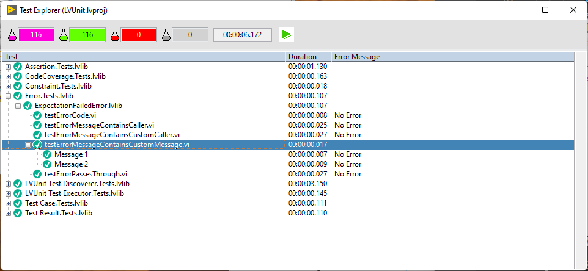
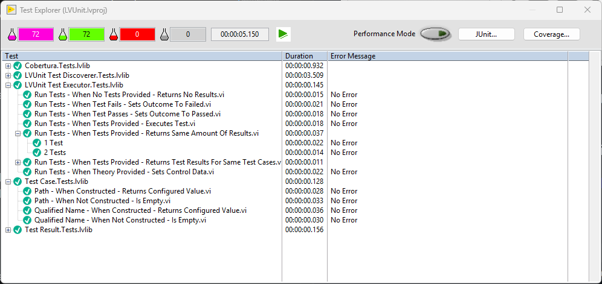
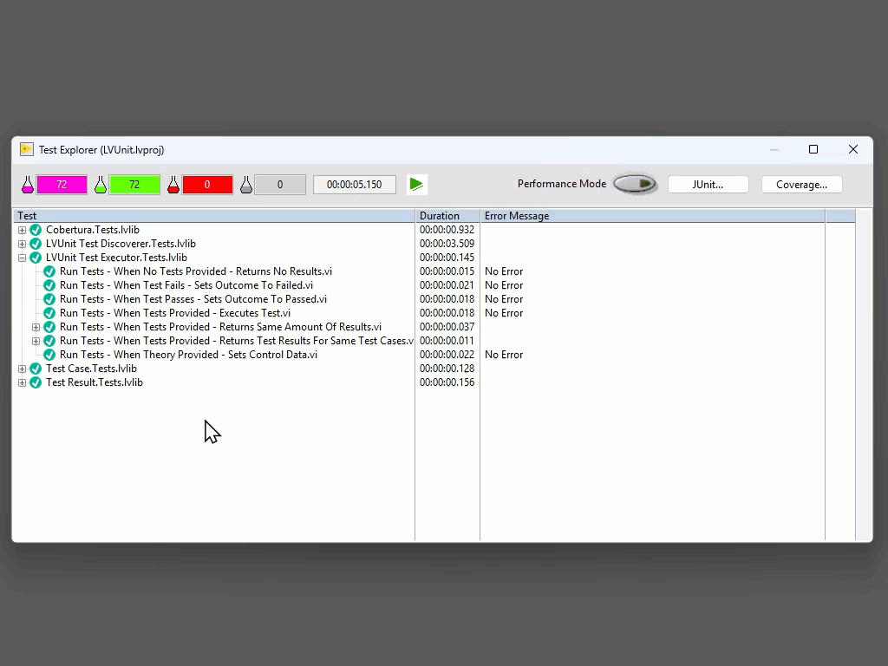
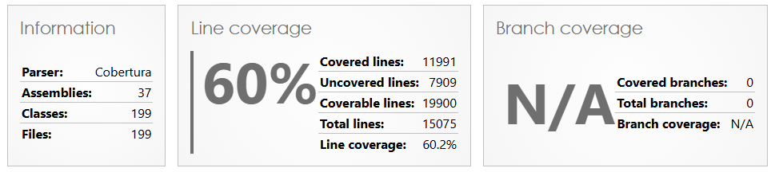
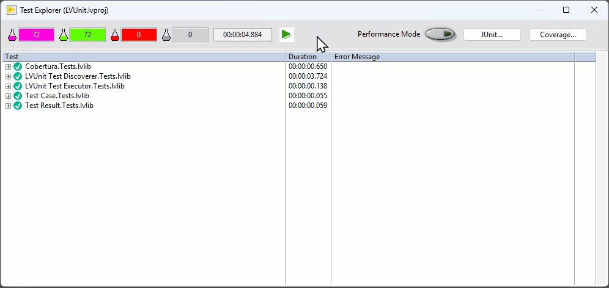

[![Contributors][contributors-shield]][contributors-url]
[![Forks][forks-shield]][forks-url]
[![Stargazers][stars-shield]][stars-url]
[![Issues][issues-shield]][issues-url]
[![BSD-3-Clause License][license-shield]][license-url]

<br>
<p align="center">
  <a href="https://github.com/logmanoriginal/LVUnit">
    
  </a>

  <h3 align="center">LVUnit</h3>

  <p align="center">
    Unit testing framework for LabVIEW&trade;
    <br>
    <a href="https://github.com/logmanoriginal/LVUnit"><strong>Explore the docs »</strong></a>
    <br>
    <br>
    <a href="https://github.com/logmanoriginal/LVUnit">View Demo</a>
    <br>
    <a href="https://github.com/logmanoriginal/LVUnit/issues">Report Bug</a>
    <br>
    <a href="https://github.com/logmanoriginal/LVUnit/issues">Request Feature</a>
  </p>
</p>

## About The Project
**LVUnit** is a unit testing framework for LabVIEW&trade;.

## Built With
* [LabVIEW&trade;](https://ni.com/labview)

## Getting Started
To get a local copy up and running follow these simple steps.

### Prerequisites
* LabVIEW&trade; 2017 or later
* VI Package Manager

### Installation
1. Clone the repo
    ```sh
    git clone https://github.com/logmanoriginal/lvunit.git
    ```
2. Install packages
    ```sh
    start .vipc
    ```
    Or apply `.vipc` manually.

## Usage

1. Open a project
2. Start Test Explorer from the Tools menu or via the Quick Drop Shortcut 'Ctrl+E'.

Test Explorer automatically scans the project and shows all detected test cases.



### Parameterized Tests (Theories)

Theories are test cases that can be executed with different data sets.

To create a theory, simply add controls to the connector pane.



To define data sets for your theory, place a JSON file with the same file name in the same folder as the test case.

For example:
* Theory1.vi
* Theory1.json

The JSON file has the following syntax:
```JSON
[
  {
    "name": "Message 1",
    "data": {
      "expected": "Failed asserting that...",
      "message": "Failed asserting that..."
    }
  },
  {
    "name": "Message 2",
    "data": {
      "expected": "Test failed!",
      "message": "Test failed!"
    }
  }
]
```

Use Test Explorer to discover and execute all theories in your project. Notice that an entry is added for each data set in your theory.



## Features

### Automatic Test Discovery and Categorization

Test Explorer automatically discovers tests in a project. When a different project is selected, Test Explorer scans the new project automatically and categorizes test cases based on their fully-qualified name into a nested tree, reflecting their natural project structure.



### Navigate to Test Case

A test case can directly be opened from Test Explorer by double-clicking an item in the tree. For theories, one of the child items must be selected, causing the test case to automatically be pre-configured with the associated test data.



### Code Coverage Reports

Test Explorer supports code coverage reports in Cobertura XML format.

> [!IMPORTANT]
> Code coverage support in LabVIEW is very limited and does not work for VIMs, polymorphic VIs, class property accessors, and any non-VI file types.

Code coverage reports represent nodes and diagrams as lines and branches. Every node on a diagram is a line. Nodes on covered diagrams count as executed. Nodes on uncovered diagrams count as not executed. The same logic is applied to branches - a covered diagram counts as an executed branch; an uncovered diagram counts as not executed branch. Furthermore, total line coverage depends on total number of nodes and diagrams covered vs. not covered.

_Example report converted to HTML using [ReportGenerator](https://github.com/danielpalme/ReportGenerator)_


### Automatic Error Detection

Any test case that returns an error on the `error out` terminal is considered a failed test. This includes broken VIs and errors that aren't the result of an assertion; enabling detection of otherwise uncaught errors.

### Skippable Test Cases

Test Explorer only runs public test cases. To disable a test case, change its scope (or the scope of its parent) to private.

### LabVIEW CLI Support

LVUnit supports `LabVIEW CLI` to run tests and generate summaries and coverage reports. See [Toolchain/Test](Toolchain/Test/) for a working example.

```cmd
LabVIEWCLI -AdditionalOperationDirectory "%cd%\Toolchain" -OperationName Test -Project "%cd%\LVUnit.lvproj" -ResultsFolder "%cd%\TestResults"
```

This operation outputs two files:
- `TEST-<project>.xml` - test results in JUnit XML format.
- `COVERAGE-<project>.xml` - code coverage results in Cobertura XML format.

### Performance Mode

Test Explorer runs in either of two modes:

* Live
* Performance (default)

When _Performance_ mode is enabled, UI updates are globally disabled for the duration of the test; resulting in better test performance.



## Design Decisions

### Depend on Transparent Assertions

LVUnit currently only discovers test cases that use [Transparent Assertions][transparent-assertions-url].

**Rationale**

LabVIEW does not have a standard API surface for test runners and assertion libraries. Existing unit test frameworks are typically closed environments which do not have the necessary API surface, ship with large dependency trees, and produce undesirable side-effects (e.g., spawning dialogs).

Transparent Assertions is a pure assertions library that does not make any assumptions about the test runner, uses standard LabVIEW notation for assertion failures (error out), and supports integration into third-party assertion frameworks (e.g., LVUnit).

By using Transparent Assertions, we can rely on correct error behavior and expressive failure messages while remaining independent - enabling users to replace LVUnit with any other test runner without changing any of the test cases.

### Only Execute Public VIs

LVUnit only executes public VIs. Test cases that are marked protected or private are not executed.

**Rationale**

The scope of a VI provides meaningful information to an observer: public VIs belong to the publicly-accessible interface, while protected and private members hide internal details. It also avoids accidentally calling internal wrappers that include assertions, which otherwise would cause the VI to be detected as a test case.

This behavior can be used to skip tests by marking them as private. Note that this also applies to entire libraries - if the library is not public, all VIs inside it are skipped too.

### Define Theories in JSON format

Theories are VIs that have controls mapped to the connector pane, and a matching JSON file next to the VI, making the VI reusable for many test cases.

**Rationale**

While other programming languages have built-in language support for parameterized tests (e.g., Attributes in C#), there is no equivalent in LabVIEW. Alternative approaches like wrapper VIs make test code harder to read, quickly become a maintenance burden, and do not sufficiently convey intend.

By using JSON files, theories become very useful in several aspects:

1. JSON files are text files that can easily be compared and diff'ed in Git
2. JSON files are very well understood by AI agents and can vastly be auto-generated
3. With the help of [JSONText][jsontext-url] and [JSONText Object Serialization][jsontext-object-serialization-url], it is possible to dynamically deserialize complex object structures from JSON.

## Roadmap
See [open issues](https://github.com/logmanoriginal/lvunit/issues) for a list of proposed features (and known issues).

## Contributing
Contributions are what make the open source community such an amazing place. Any contributions you make are greatly appreciated :sparkling_heart:

1. Fork the Project
2. Create your Feature Branch (`git checkout -b feature/AmazingFeature`)
3. Commit your Changes (`git commit -m 'Add some AmazingFeature'`)
4. Push to the Branch (`git push origin feature/AmazingFeature`)
5. Open a Pull Request

Keep in mind that LabVIEW&trade; VIs are binary files, which are difficult to merge.
- Only change a single VI or library.
- Avoid conflicts with other pull requests (don't work on the same libraries or VIs).
- Send VI Snippets (via issues) instead of pull requests when possible.

## License
Distributed under the BSD-3-Clause license. See [LICENSE](LICENSE) for more information.

## Contact

Project Link: [https://github.com/logmanoriginal/lvunit](https://github.com/logmanoriginal/lvunit)

## Acknowledgements
* [JSONtext](https://bitbucket.org/drjdpowell/jsontext)

<!-- https://www.markdownguide.org/basic-syntax/#reference-style-links -->
[contributors-shield]: https://img.shields.io/github/contributors/logmanoriginal/LVUnit?style=for-the-badge
[contributors-url]: https://github.com/logmanoriginal/LVUnit/graphs/contributors
[forks-shield]: https://img.shields.io/github/forks/logmanoriginal/LVUnit?style=for-the-badge
[forks-url]: https://github.com/logmanoriginal/LVUnit/network/members
[stars-shield]: https://img.shields.io/github/stars/logmanoriginal/LVUnit?style=for-the-badge
[stars-url]: https://github.com/logmanoriginal/LVUnit/stargazers
[issues-shield]: https://img.shields.io/github/issues/logmanoriginal/LVUnit?style=for-the-badge
[issues-url]: https://github.com/logmanoriginal/LVUnit/issues
[license-shield]: https://img.shields.io/github/license/logmanoriginal/LVUnit?style=for-the-badge
[license-url]: https://github.com/logmanoriginal/LVUnit/blob/master/LICENSE.txt
[transparent-assertions-url]: https://github.com/logmanoriginal/TransparentAssertions
[jsontext-url]: https://bitbucket.org/drjdpowell/jsontext
[jsontext-object-serialization-url]: https://github.com/logmanoriginal/JSONtext-Object-Serialization
